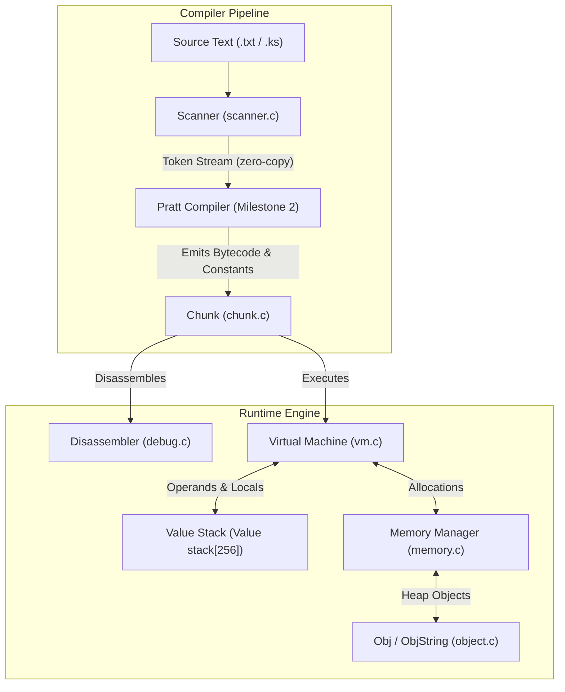

# Kestrel Architecture & VM Internals

This document details the architectural design, internal memory models, and execution pipeline of the **Kestrel** bytecode programming language.

---

## 1. High-Level System Architecture

Kestrel is organized into distinct, modular compiler and runtime phases. The architecture decouples lexical analysis from bytecode compilation, and bytecode compilation from runtime execution.



---

## 2. Compilation Subsystem

### 2.1 The Scanner (`scanner.h`, `scanner.c`)
The scanner is a single-pass, maximal-munch lexer that streams tokens on-demand via `scanToken()`.

#### Key Design Decisions:
* **Zero-Copy Tokens**: The `Token` struct stores a pointer directly into the original source buffer (`const char* start`) and an integer `length`. It does not allocate heap memory for lexemes.
* **Separation of Concerns**: The scanner does not convert literals into runtime values (e.g. converting `"3.14"` to `double` or `\"hello\"` to `ObjString`). Literal conversion is deferred entirely to the compiler.
* **Unicode / Non-ASCII Safety**: Standard `<ctype.h>` functions (`isalpha`, `isdigit`) exhibit undefined behavior when passed negative signed `char` values. All calls in `scanner.c` explicitly cast to `(unsigned char)`.
* **String Escape Sequences**: Strings allow backslash escapes (`\"`, `\\`, `\n`, `\t`, `\r`). The scanner consumes the escaped character without prematurely closing the string, preserving source integrity for the compiler unescape phase.
* **Syntax Guarding**: Malformed number literals like `123abc` are captured at the lexical boundary as `TOKEN_ERROR` ("Invalid number literal."), preventing ambiguous identifier splits.

---

## 3. Bytecode Representation (`chunk.h`, `chunk.c`)

A `Chunk` represents a compiled bytecode sequence (such as a top-level script or a function body).

```c
typedef struct {
  int count;              // Number of bytecode bytes currently written
  int capacity;           // Allocated bytecode buffer capacity
  uint8_t* code;          // Dynamic array of instruction opcodes & operands
  int* lines;             // Parallel array of source line numbers for debug info
  ValueArray constants;   // Constant pool storing literals referenced by bytecode
} Chunk;
```

### Constant Pool Constraints
* Bytecode instructions (such as `OP_CONSTANT`) address the constant pool using a single-byte `uint8_t` operand.
* `addConstant()` checks `constants.count >= UINT8_COUNT` (256) and exits with `EX_SOFTWARE` (70) rather than silently truncating higher indices to 8 bits.

### Dynamic Memory Growth
All dynamic buffers (`code`, `lines`, `constants.values`) grow exponentially via `GROW_CAPACITY`:
$$\text{capacity} = \begin{cases} 8 & \text{if capacity} < 8 \\ \text{capacity} \times 2 & \text{otherwise} \end{cases}$$

---

## 4. Value Representation & Object Model (`value.h`, `object.h`)

### 4.1 Tagged Union Value
Kestrel uses an explicit tagged-union representation for runtime values.

```c
typedef enum {
  VAL_BOOL,
  VAL_NIL,
  VAL_NUMBER,
  VAL_OBJ
} ValueType;

typedef struct {
  ValueType type;
  union {
    bool boolean;
    double number;
    Obj* obj;
  } as;
} Value;
```

#### Rationale: Tagged Union vs. NaN-Boxing
* **Clarity First**: The tagged union provides straightforward debugging and simple C memory inspection.
* **Drop-in Upgrade**: Because all code interacts with values via `IS_*` and `AS_*` accessor macros, the project can transition to NaN-boxing in the future without altering opcode definitions or the compiler.

### 4.2 Truthiness Semantics
Kestrel adheres to a clean, unambiguous truthiness rule:
* **Falsy**: Only `nil` and `false`.
* **Truthy**: Everything else, including `0.0`, empty strings, and functions.

```c
#define IS_FALSY(value) \
  (IS_NIL(value) || (IS_BOOL(value) && !AS_BOOL(value)))
```

### 4.3 Heap Objects & Memory Headers
All heap-allocated entities share an `Obj` header:

```c
struct sObj {
  ObjType type;
  bool isMarked;       // Mark bit for Milestone 4 Garbage Collector
  struct sObj* next;   // Intrusive singly-linked list of all allocated objects
};
```

Strings are allocated inline using C99 flexible array members:
```c
struct sObjString {
  Obj obj;
  int length;
  char chars[];        // Flexible array member: character data stored inline
};
```

---

## 5. Virtual Machine (`vm.h`, `vm.c`)

The Kestrel VM is a stack-based abstract machine with a single global state instance (`VM vm`).

```c
typedef struct {
  Chunk* chunk;
  uint8_t* ip;                     // Instruction pointer into chunk->code
  Value stack[STACK_MAX];          // Operand and local variable stack (256 slots)
  Value* stackTop;                 // Points to the next free slot on the stack
} VM;
```

### 5.1 Stack Discipline & Safety
1. **Assertions**: `push()` and `pop()` assert stack bounds in debug builds (`vm.stackTop < vm.stack + STACK_MAX` and `vm.stackTop > vm.stack`).
2. **Peeking**: `peek(int distance)` accesses values relative to the stack top without popping them (`vm.stackTop[-1 - distance]`).
3. **Dynamic Type Validation**: Arithmetic operations check operand types with `IS_NUMBER()` before executing operations. If a type mismatch occurs, `runtimeError()` outputs an informative error message and line number, resets the stack, and exits the run loop with `INTERPRET_RUNTIME_ERROR`.

### 5.2 Error Reporting & Stack Unwinding
When a runtime error occurs:
```c
static void runtimeError(const char* format, ...) {
  // 1. Prints formatted diagnostic message to stderr
  // 2. Looks up the offending source line via chunk->lines
  // 3. Resets vm.stackTop to vm.stack to prevent stack leak/corruption
}
```

---

## 6. Memory Management (`memory.h`, `memory.c`)

All dynamic allocations, reallocations, and deallocations pass through a single entry point:

```c
void* reallocate(void* pointer, size_t oldSize, size_t newSize);
```

| Operation | `pointer` | `oldSize` | `newSize` | Behavior |
| :--- | :--- | :--- | :--- | :--- |
| **Allocate** | `NULL` | `0` | $> 0$ | Calls `realloc(NULL, newSize)`. |
| **Grow** | Existing buffer | Current bytes | New bytes | Calls `realloc(pointer, newSize)`. |
| **Free** | Existing buffer | Current bytes | `0` | Calls `free(pointer)`, returns `NULL`. |

> [!NOTE]
> In Milestone 4, `reallocate()` becomes the primary hook for garbage collection. When memory allocation thresholds are reached, the mark-and-sweep collector will trigger directly inside this function.

---

## 7. Exit Codes

Kestrel follows the standard BSD `<sysexits.h>` exit conventions:

| Exit Code | Constant | Meaning |
| :---: | :--- | :--- |
| `0` | `EXIT_SUCCESS` | Execution completed without error. |
| `64` | `EX_USAGE` | Invalid command-line usage or incorrect argument count. |
| `65` | `EX_DATAERR` | Lexical error, syntax error, or compile failure in source file. |
| `70` | `EX_SOFTWARE` | Internal engine error (e.g. constant pool overflow). |
| `74` | `EX_IOERR` | File could not be opened, read, or accessed. |
